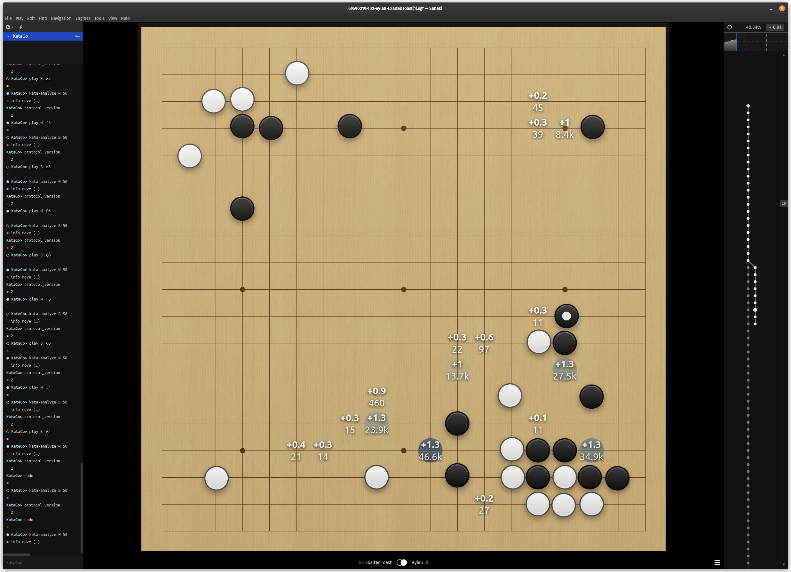

# Sabaki Subdued Theme

## Cold Edition

This is a fork of the original [Subdued Theme by Rooklift](https://github.com/rooklift/sabaki_subdued_theme_40) that turns down the analysis heatmap colors.
I happen to like the blue much more than the original four-color palette.



## Usage

1. Verify the version of [Sabaki SGF](https://github.com/yishn/Sabaki) is **0.40.0** or later.
2. Download the `.asar` file.
3. In Sabaki, go to `File` -> `Preferences` -> `Themes` -> `Install Theme`.
4. Select the downloaded `.asar` file.

## Modifying

1. Modify the theme in `./subdued`.
2. Package the theme using [NPM](https://www.npmjs.com/).

```sh
npx asar pack ./subdued subdued.asar
```

To reload the theme in Sabaki, reinstall the new `.asar` using Usage the steps above.

## Contributing

I'm open to feedback.
Feel free to submit contributions as you please.
For the most part, I'll test the changes locally and merge them if I like them.

Current ideas:

- Experiment more with colors to find a better scheme.
- Experiment with drop shadow parameters to make the blurring look better.
- Make colors higher contrast.
